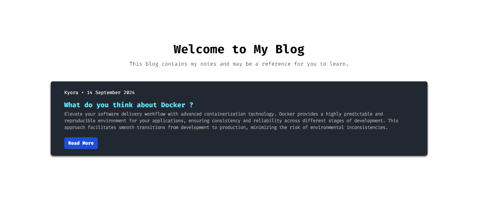

## Nereid



## Installation
first, clone this repository
```bash
$ git clone https://github.com/rulanugrh/nereid.git
```

after that you can copy env
```bash
$ cp .env.example .env
```

and then, you can running this command
```bash
$ go mod tidy && go run main.go
```